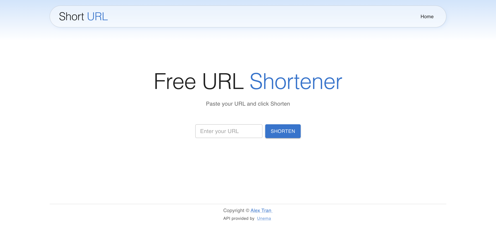
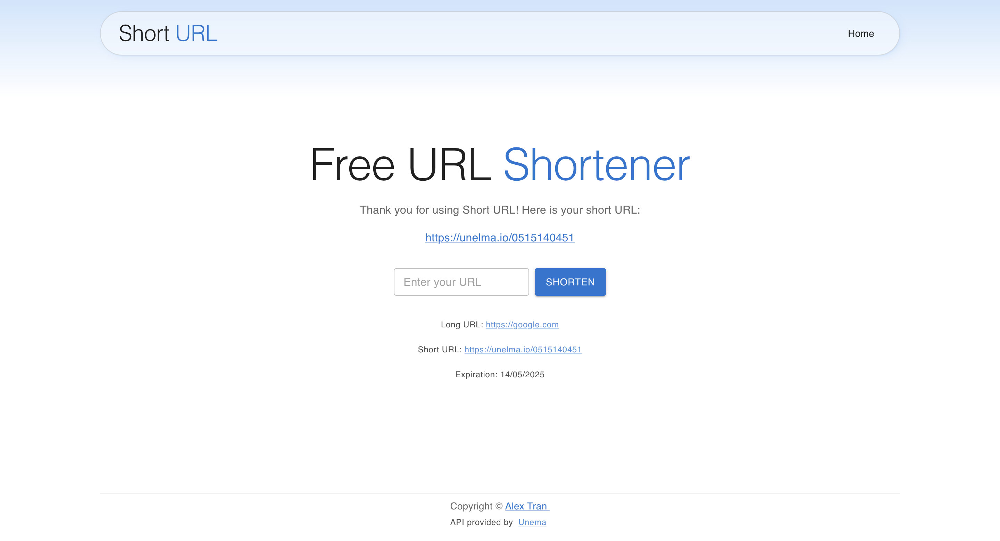

# fullstack_url_shortener

A Shorten url app using unelma.io api
_Shorted URL will expired after 1 year_

## Functions
- Take user link input
- Shorten the URL and return the short link with expiration date
- Debounce the link submit to prevent resubmit and overloading the API

## Technologies used

- React/vite/js
- Axios
- Material UI
- Unelma API

## Setup and usage

**Cloning**
First, clone the project ```git clone https://github.com/alextrandev/fullstack_url_shortener.git```
Then change to the project directory ```cd fullstack_url_shortener```

**Create .env file to store your api key**
- Go to [unelma.io](https://unelma.io/) and sign up
- Go to account settings and create a new api key, copy the key
- Create a ".env" file inside the root of the folder
- In the .env file, write this line and put the key inside the quote
```env
VITE_UNELMA_API_TOKEN=""
```

**Host the project in localhost**

```shell
npm run dev
```

## Screenshot
**Homepage**


**After shortened URL**


## Sources 

- [Material UI](https://mui.com/)
- [Unelma API](https://unelmacloud.com/api-docs)